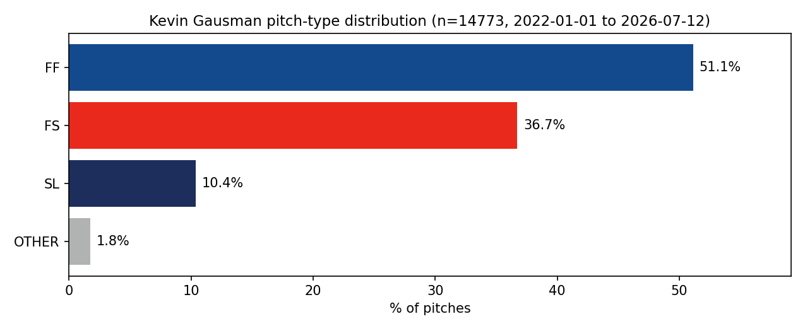
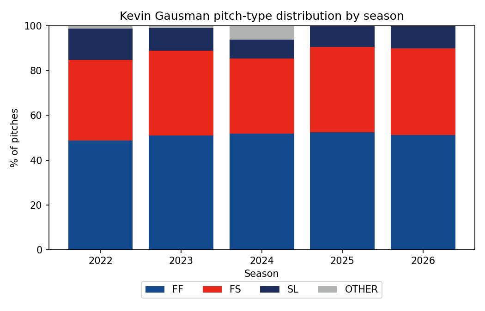
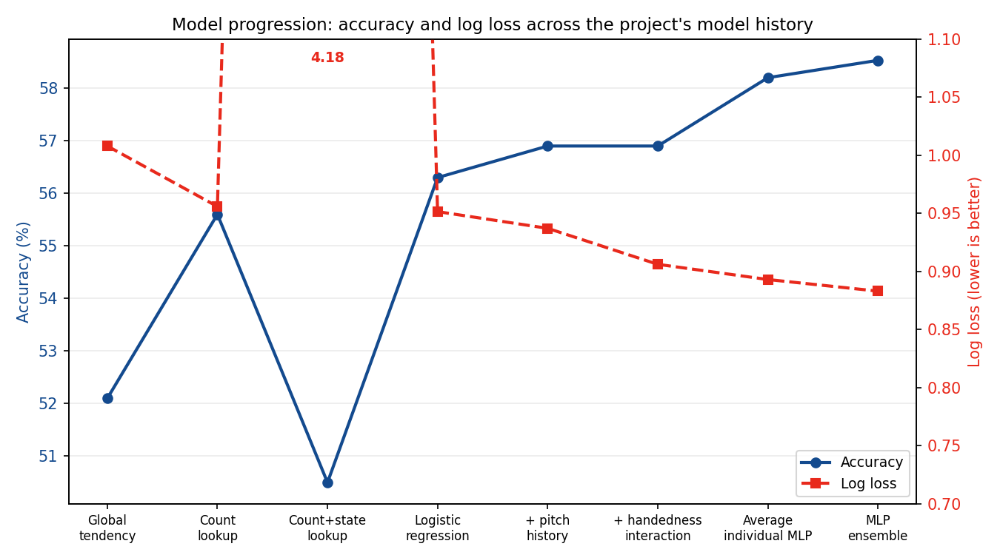
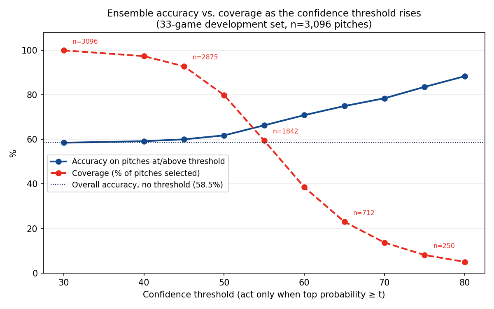

# Pitch Sitch Predictch


**Can a machine-learning model identify when an MLB pitcher becomes predictable?**

Pitch Sitch Predictch is an exploratory next-pitch prediction project built around Kevin Gausman. Using only information available before the pitch is thrown, the model estimates the probability that his next pitch will be a:

- four-seam fastball (`FF`);
- splitter (`FS`);
- slider (`SL`);
- different pitch type (`OTHER`).

The current 10-model neural-network ensemble is **58.5% accurate across all pitches**. More importantly, its confidence is useful: when the model is allowed to abstain from uncertain situations, accuracy rises substantially.

## Results at a glance

| Prediction rule                |  Accuracy | Pitch coverage |
| ------------------------------ | --------: | -------------: |
| Predict every pitch            | **58.5%** |           100% |
| Act only when confidence ≥ 65% | **75.0%** |          23.0% |
| Act only when confidence ≥ 75% | **83.6%** |           8.1% |

Full threshold-by-threshold breakdown and chart: see [Selective prediction](#selective-prediction) below.

This suggests that the model is more valuable as a **selective predictor** than as an always-on classifier.

Rather than making a recommendation before every pitch, a practical system could wait until it encounters an unusually predictable situation.

> On the roughly 23% of pitches where the model assigns at least 65% confidence, it is currently 75% accurate.

These results come from a repeatedly inspected 33-game development set. They describe the model’s current behaviour, but they are **not yet an untouched out-of-sample performance claim**. I plan on testing on future Gausman starts as he continues to pitch in the 2026 season.

---

## The baseball question

Pitch selection is not random. It can depend on:

- the count;
- batter handedness;
- inning, score, outs, and baserunners;
- the previous pitch and its result;
- recent pitch sequencing;
- a pitcher’s repertoire and strategic tendencies.

The project asks:

> Can these signals identify situations where one pitch becomes likely enough to provide useful information to a batter, coach, analyst, or pitcher?

The practical value may not require predicting every pitch correctly.

For example, an imagined decision-support system wouldn't need to show the same kind of message for every pitch — it could distinguish between situations where it has a strong read and situations where it doesn't. (The two boxes below are a hypothetical mockup of what that output might look like, not a real prediction pulled from the data.)

When the model is confident:

```
Likely next pitch: Four-seam fastball
Model probability: 76%
```

When it isn't — the probability spread across multiple pitch types instead of concentrated on one:

```
No strong prediction
FF: 41%
FS: 37%
SL: 16%
OTHER: 6%
```

The system would only be worth acting on in cases like the first. The current high-confidence regime is primarily a **fastball-versus-splitter prediction problem**. The model rarely makes slider predictions and does not currently predict `OTHER` as its top class.

---

## Why Kevin Gausman?

Gausman’s repertoire is heavily concentrated around two pitches: his four-seam fastball and splitter.

Across the cleaned modelling dataset, those two pitches account for **87.9% of everything he throws**.

| Pitch class               | Count |  Share |
| ------------------------- | ----: | -----: |
| Four-seam fastball (`FF`) | 7,554 | 51.13% |
| Splitter (`FS`)           | 5,424 | 36.72% |
| Slider (`SL`)             | 1,533 | 10.38% |
| Other (`OTHER`)           |   262 |  1.77% |



This creates a deceptively difficult prediction problem. An always-fastball baseline is already correct on **52.07% of pitches in the development set**. A useful model therefore needs to do more than identify his most common pitch: it needs to determine when the situation points toward the fastball and when it points toward the splitter.

The current ensemble improves overall development-set accuracy from **52.07% to 58.53%**, while its greatest value comes from identifying smaller subsets of much more predictable situations.

### Repertoire by season

Gausman’s core fastball-splitter usage has remained relatively stable, although the smaller pitch classes have changed over time.



`OTHER` is only 1.77% of the full dataset, but it is not one consistent pitch family. It includes sinkers, changeups, and sweepers. Most notably, Gausman briefly added a sinker in 2024, when `OTHER` rose to **6.20%** of his pitches, before nearly disappearing again in 2025.

This is a known limitation of the four-class target: `OTHER` is largely irrelevant to overall accuracy, but it can hide meaningful temporary repertoire changes.

Gausman is the first case study, not the intended limit of the project. A longer-term goal is to train across many pitchers and adapt the shared model to individual pitchers.

(Another reason for Gausman: he has been a bonafide ace for my Toronto Blue Jays the last few seasons.)

---

## Model inputs

The current model uses 56 features, all derived from information available before the target pitch.

### Count and plate-appearance state

- balls and strikes;
- outs;
- inning;
- top or bottom half;
- score differential;
- runners on first, second, and third.

### Recent pitch sequence

- previous pitch type;
- previous pitch result;
- previous pitch location;
- pitch type two pitches ago;
- pitch type three pitches ago.

Pitch history resets at the beginning of each plate appearance.

### Matchup information

- batter handedness;
- interaction between batter handedness and number of strikes.

Batter identity is retained in the data but is not currently used as a direct model input.

### Future features I'd like to test

- swing timing of previous pitches (early, on-time, late) — could carry real signal.
  - example intution: pitcher is likely to follow up a late swing on a fastball with another fastball.
  - problem: Savant publishes early/on-time/late as aggregated season/pitch-type rates, not per pitch. It's likely derived from per-pitch bat-tracking geometry (e.g. where the bat's sweet spot crosses the ball's path relative to the batter) that is publicly available. Would need to devise formula for labelling myself.
- richer batter information (batter identity / batter-specific tendencies), rather than handedness alone.

---

## Model progression

The project started with simple empirical baselines and added complexity incrementally, keeping each addition only when it measurably improved results.

| Model                                |  Accuracy |   Log loss |
| ------------------------------------ | --------: | ---------: |
| Global pitch tendency                |     52.1% |     1.0080 |
| Count lookup table                   |     55.6% |     0.9559 |
| Count + game-state lookup            |     50.5% |     4.1806 |
| Multinomial logistic regression      |     56.3% |     0.9515 |
| Logistic + pitch history             |     56.9% |     0.9371 |
| Logistic + handedness interaction    |     56.9% |     0.9061 |
| Average individual MLP               |     58.2% |     0.8930 |
| **10-seed MLP probability ensemble** | **58.5%** | **0.8830** |



The count-and-game-state lookup table failed because the feature combinations became extremely sparse (visible as the log-loss spike to 4.18 above) — logistic regression solved this by sharing statistical strength across situations.

A small multilayer perceptron then improved both accuracy and probability quality. This improvement is due to its ability to discover useful feature combinations instead of relying on manually engineered interaction terms. The final model averages the predicted probability vectors from ten independently initialized neural networks.

### Current leading model

- two hidden layers: 32 and 16 units;
- regularization parameter: `alpha=0.001`;
- 19 training epochs;
- ten independently initialized models;
- arithmetic mean of their class probabilities.

The ensemble achieved:

- **Accuracy:** 0.5853
- **Log loss:** 0.8830
- **Brier score:** 0.5189

The logistic model remains in the project as an interpretable baseline.

---

## Selective prediction

Overall accuracy hides one of the project’s most important findings:

> The model is substantially better in the situations where it says it is confident.

The model’s confidence is defined as the largest class probability in its output distribution.

For a threshold `t`, the system acts only when:

```
max_k P(Y = k | x) >= t
```

Two quantities then matter:

### Accuracy

How often is the selected pitch correct?

### Coverage

What proportion of pitches exceed the confidence threshold?

As the confidence threshold rises, coverage falls but accuracy increases.



The model is also reasonably calibrated across most of the observed confidence range. For example, among pitches with at least 60% confidence:

- mean model confidence: **69.1%**;
- realized accuracy: **70.9%**.

It is not merely assigning large probabilities without corresponding performance.

### Possible operating modes

All figures below are on the 33-game development set (n=3,096 pitches).

| Mode                 | Threshold | Accuracy | Coverage | Pitches selected |
| -------------------- | --------: | -------: | -------: | ---------------: |
| Broad                |      ≥55% |    66.3% |    59.5% |            1,842 |
| Balanced             |      ≥60% |    70.9% |    38.5% |            1,193 |
| Selective            |      ≥65% |    75.0% |    23.0% |              712 |
| High confidence      |      ≥70% |    78.5% |    13.7% |              423 |
| Very high confidence |      ≥75% |    83.6% |     8.1% |              250 |

These are candidate operating points, not finalized deployment thresholds.

---

## What the model currently does well

### It finds predictable situations

Accuracy rises cleanly as confidence rises. The model is not equally uncertain on every pitch.

### It improves probability quality

The ensemble beats the strongest logistic baseline on:

- accuracy;
- log loss;
- Brier score.

### It captures nonlinear interactions

The neural model improves on the linear baseline without requiring every interaction to be manually specified.

### It distinguishes fastballs from splitters

The strongest current use case is identifying situations where Gausman is especially likely to throw one of his two main pitches.

---

## What the model does not yet do well

### Slider and OTHER predictions

The ensemble predicts slider as its top class on **0.06%** of development-set pitches, and never predicts `OTHER` (0.00%) — despite those classes making up 10.4% and 1.8% of what Gausman actually throws.

This does not mean the probabilities contain no information about those classes. It means their predicted probability rarely becomes larger than the fastball or splitter probability.

### Generalization beyond Gausman

The current model is trained specifically on one pitcher.

### Location prediction

The model predicts pitch type only. It does not yet predict where the pitch will be located.

### Proven batter value

Predicting the pitch correctly does not automatically prove that a batter would perform better after receiving the prediction.

A real decision system would need to account for the asymmetric cost of being wrong:

```
EV(sit on pitch) = p*A - (1-p)*B
```

where:

- `p` is the probability that the predicted pitch occurs;
- `A` is the value of correctly anticipating it;
- `B` is the cost of anticipating the wrong pitch.

The required confidence threshold depends on the real baseball values of `A` and `B`.

---

## Evaluation design

Pitches are split at the **game level**, not individually.

All pitches from a game remain together. This prevents adjacent pitches from the same plate appearance from appearing in both training and evaluation data.

The current split contains:

- 131 training games;
- 33 development games.

### Important limitation

The same 33 development games have been used repeatedly while testing features and model variants.

They should therefore be treated as development or validation data, not as an untouched final test set.

The next major validation step is:

1. freeze the model and confidence thresholds;
2. collect future Gausman games;
3. evaluate them without changing the model;
4. compare selective accuracy against simple baselines on the exact same pitches.

Until then, the results should be read as:

> A strong and stable development-set finding that motivates prospective evaluation.

Not:

> A proven estimate of future MLB performance.

---

## Repository structure

```
pitch_sitch/
    Core data preparation, feature construction, models, and evaluation

scripts/
    Reproducible experiment entry points

notes/
    current-state.md
    decisions.md
    research-log.md
    sessions/

artifacts/
    Saved outputs from selected experiments
```

For the shortest description of what is currently true, see:

```
notes/current-state.md
```

For accepted methodological choices and their rationale:

```
notes/decisions.md
```

For the chronological research history:

```
notes/research-log.md
notes/sessions/
```

The main ensemble artifact is stored at:

```
artifacts/experiments/20260713-mlp-seed-ensemble-v1/
```

---

## Next steps

### Modelling

- Investigate richer batter information.
- Explore more targeted uses of bat-tracking measurements on previous pitches.
- Model pitch location after pitch-type prediction is better established.

### Generalization

- Train a shared model across many pitchers.
- Learn general pitch-selection structure.
- Fine-tune the shared model to individual pitchers.
- Compare adaptation against pitcher-specific training from scratch.

---

## Current conclusion

The model is not yet a deployable MLB decision system.

It is already a meaningful result.

Across all pitches, the ensemble reaches 58.5% accuracy. When it is permitted to abstain, it identifies a much smaller set of situations where Gausman appears substantially more predictable:

> Approximately **75% accuracy on 23% of pitches** at the current 65% confidence threshold.

The central finding is therefore not simply that next-pitch prediction is possible.

It is that **predictability is uneven**, and a model may be most valuable when it knows which situations are worth acting on.
